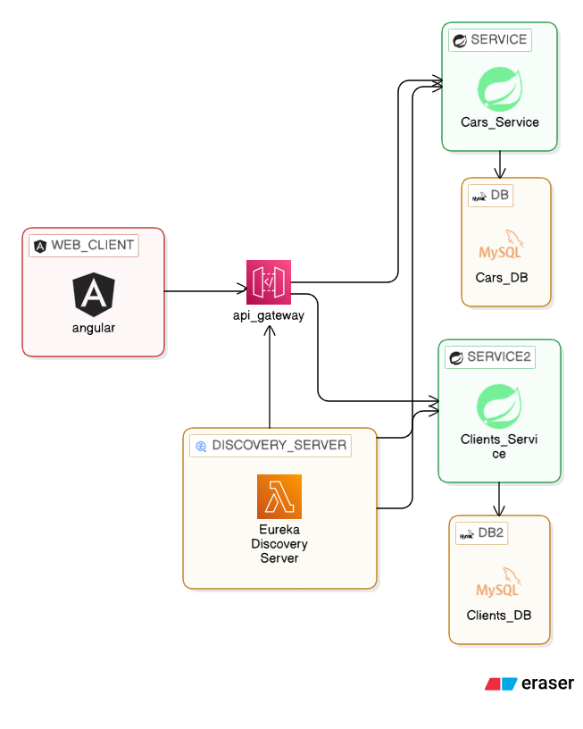

# Microservice-Clients-Car
A microservices-based vehicle and client management system built with Spring Boot and Angular.
# AutoNexus: Car & Client Management System

<div align="center">
  
</div>

AutoNexus is a microservices-based application for managing clients and their vehicles. The system provides full CRUD operations on clients and cars, inter-service communication via Spring HTTP interfaces, centralized routing through an API Gateway, and a responsive Angular frontend — all tied together with Eureka service discovery.

---

## 📋 Table of Contents

- [🏗 Software Architecture](#-software-architecture)
- [💾 Data Models](#-data-models)
- [🔌 API Endpoints](#-api-endpoints)
- [🚀 Getting Started](#-getting-started)
- [🐳 Docker Deployment](#-docker-deployment)
- [✨ Features](#-features)
- [⚙️ Key Configuration](#️-key-configuration)
- [🧪 Sample Test Data](#-sample-test-data)
- [⚠️ Common Issues & Solutions](#️-common-issues--solutions)
- [🌟 Future Enhancements](#-future-enhancements)

---

## 🏗 Software Architecture

The AutoNexus platform is composed of the following services:

| Service | Port | Description |
|---------|------|-------------|
| **Eureka Server** | 8761 | Service discovery — all services register here |
| **API Gateway** | 8889 | Single entry point for all client requests |
| **Clients Service** | 8089 | Manages client data (CRUD) |
| **Cars Service** | 8085 | Manages car data (CRUD) |
| **MySQL — ClientDB** | 3306 | Dedicated database for clients |
| **MySQL — CarsDB** | 3307 | Dedicated database for cars |
| **Angular Frontend** | 4200 | Responsive user interface |

### Communication Flow

```
Browser → Angular (4200) → API Gateway (8889) → Eureka (8761) → Microservices → Databases
```

1. Frontend sends requests to the API Gateway
2. Gateway resolves the target service via Eureka
3. Gateway forwards the request to the appropriate microservice
4. Service queries its own dedicated database
5. Response travels back through the chain to the browser

### Key Design Decisions

- **Database per service** — Clients and Cars each have their own isolated MySQL instance
- **HTTP Interface (Spring Boot 4)** — Cars Service calls Clients Service using Spring's native `@HttpExchange` instead of Feign (Feign is not supported in Spring Boot 4)
- **Standalone Angular components** — no NgModules; uses Angular 17+ standalone architecture
- **All traffic through Gateway** — frontend never calls microservices directly

---

## 💾 Data Models

### Client (`clients-service`)
```json
{
  "id": 1,
  "name": "Younes Azzehizi",
  "age": 21.0
}
```

### Car (`cars-service`)
```json
{
  "id": 1,
  "type": "Toyota",
  "plateNumber": "A 25 333",
  "model": "Corolla",
  "clientId": 1
}
```

**Relationship:** One client → many cars (one-to-many via `clientId`)

---

## 🔌 API Endpoints

All requests go through the gateway at `http://localhost:8889`

### Clients

```
GET    /api/clients            # Get all clients
GET    /api/clients/{id}       # Get client by ID
POST   /api/clients            # Create new client
PUT    /api/clients/{id}       # Update client
DELETE /api/clients/{id}       # Delete client
```

### Cars

```
GET    /api/cars               # Get all cars
GET    /api/cars/{id}          # Get car by ID
GET    /api/cars/client/{id}   # Get all cars for a client
POST   /api/cars               # Create new car
PUT    /api/cars/{id}          # Update car
DELETE /api/cars/{id}          # Delete car
```

---

## 🚀 Getting Started

### Prerequisites

- Java 21
- Maven 3.8+
- Node.js 18+ & Angular CLI
- MySQL 8.0 (or Docker)
- Spring Boot 4.0.3
- Spring Cloud 2025.1.0

### ⚠️ Start Order (Critical!)

Services must be started in this exact order — Eureka must be running before anything else registers.

**1. Start Eureka Server**
```bash
cd eureka-server
mvn spring-boot:run
```
Verify at: http://localhost:8761

**2. Start MySQL Databases**
```bash
# Using Docker (recommended)
docker run --name mysql-client \
  -e MYSQL_ROOT_PASSWORD=root \
  -e MYSQL_DATABASE=clientdb \
  -p 3306:3306 -d mysql:8.0

docker run --name mysql-cars \
  -e MYSQL_ROOT_PASSWORD=root \
  -e MYSQL_DATABASE=carsdb \
  -p 3307:3306 -d mysql:8.0
```

**3. Start Clients Service**
```bash
cd clients-service
mvn spring-boot:run
```

**4. Start Cars Service**
```bash
cd cars-service
mvn spring-boot:run
```

**5. Start API Gateway**
```bash
cd api-gateway
mvn spring-boot:run
```

**6. Start Angular Frontend**
```bash
cd angular-frontend
npm install
ng serve -o
```

### Verify Everything is Working

- **Eureka Dashboard**: http://localhost:8761 — should show `CLIENTS-SERVICE`, `CARS-SERVICE`, and `API-GATEWAY` registered
- **Angular Frontend**: http://localhost:4200
- **Test API directly**: `curl http://localhost:8889/api/clients`

---

## 🐳 Docker Deployment

```bash
# Start all services at once
docker-compose up -d

# Stop all services
docker-compose down

# Rebuild images after code changes
docker-compose up -d --build
```

Docker Compose spins up: Eureka, API Gateway, Clients Service, Cars Service, and two MySQL instances — all on a shared `app-network` bridge.

---

## ✨ Features

- ✅ Full CRUD for Clients
- ✅ Full CRUD for Cars
- ✅ Client-vehicle relationship (view all cars by client)
- ✅ Service discovery via Eureka
- ✅ API Gateway with route-based forwarding
- ✅ CORS configured for Angular frontend
- ✅ Inter-service HTTP calls (Cars → Clients) via Spring HTTP Interface
- ✅ Responsive Angular 17+ UI with standalone components
- ✅ Separate databases per service (database-per-service pattern)
- ✅ Docker support

---

## ⚙️ Key Configuration

### API Gateway — CORS (`application.yml`)

```yaml
spring:
  cloud:
    gateway:
      mvc:
        eager-route-resolution: true
```

CORS is handled via a `CorsFilter` bean (Spring Boot 4 uses Gateway MVC, not reactive — `CorsWebFilter` does not apply):

```java
@Bean
public CorsFilter corsFilter() {
    CorsConfiguration config = new CorsConfiguration();
    config.addAllowedOrigin("http://localhost:4200");
    config.addAllowedMethod("*");
    config.addAllowedHeader("*");
    config.setAllowCredentials(false);

    UrlBasedCorsConfigurationSource source = new UrlBasedCorsConfigurationSource();
    source.registerCorsConfiguration("/**", config);

    return new CorsFilter(source);
}
```

### Faster Eureka Sync (all services)

```yaml
eureka:
  instance:
    lease-renewal-interval-in-seconds: 5
    lease-expiration-duration-in-seconds: 10
  client:
    registry-fetch-interval-seconds: 5
```

### Angular Services — Always use Gateway URL

```typescript
private apiUrl = 'http://localhost:8889/api/clients'; // ✅ through gateway
// NOT: 'http://localhost:8089/api/clients'           // ❌ direct service
```

### Cars Service — HTTP Interface (replaces Feign)

```java
@HttpExchange("http://localhost:8081")
public interface ClientService {
    @GetExchange("/api/clients/{id}")
    Client getClientById(@PathVariable Long id);
}
```

---

## 🧪 Sample Test Data

### Create a client
```bash
curl -X POST http://localhost:8889/api/clients \
  -H "Content-Type: application/json" \
  -d '{"name":"Younes Azzehizi","age":21}'
```

### Create a car (assigned to client ID 1)
```bash
curl -X POST http://localhost:8889/api/cars \
  -H "Content-Type: application/json" \
  -d '{"type":"Toyota","plateNumber":"A 25 333","model":"Corolla","clientId":1}'
```

### Get all cars for client 1
```bash
curl http://localhost:8889/api/cars/client/1
```

---

## ⚠️ Common Issues & Solutions

### 1. CORS error in browser
**Cause**: `CorsWebFilter` (reactive) doesn't work with Gateway MVC.
**Fix**: Use `org.springframework.web.filter.CorsFilter` (servlet) in a `@Configuration` class. See configuration above.

### 2. Feign deserialization error
**Cause**: Feign is not compatible with Spring Boot 4 / Spring Cloud 2025.x.
**Fix**: Replace `@FeignClient` with Spring's `@HttpExchange` + `HttpServiceProxyFactory`. See Cars Service config above.

### 3. Services not appearing in Eureka
**Fix**: Always start Eureka first. Reduce `registry-fetch-interval-seconds` to 5 for faster registration.

### 4. Data not loading on first Angular page load
**Fix**: Eureka registry hasn't synced yet. Add `retry(2)` to Angular HTTP calls and reduce Eureka intervals (see configuration above).

### 5. Database connection errors
**Fix**: Confirm MySQL containers are running (`docker ps`) and that ports match `application.yml`.

### 6. `no suitable HttpMessageConverter` error
**Fix**: Ensure your `Client` DTO class has a no-arg constructor, getters/setters, and `@JsonIgnoreProperties(ignoreUnknown = true)`. Verify field names match the JSON returned by the other service.

---

## 📁 Project Structure

```
AutoNexus/
├── eureka-server/          # Spring Cloud Netflix Eureka
├── api-gateway/            # Spring Cloud Gateway MVC
├── clients-service/        # Client management microservice
├── cars-service/           # Car management microservice
├── angular-frontend/       # Angular 17+ standalone app
├── docker-compose.yml      # Full stack Docker config
└── pom.xml                 # Parent POM (Spring Boot 4.0.3)
```

---

## 🌟 Future Enhancements

1. **Authentication & Authorization** — JWT-based security with role-based access control
2. **Monitoring** — Prometheus + Grafana dashboards for service health and metrics
3. **Circuit Breakers** — Resilience4j for fault tolerance between services
4. **Cloud Deployment** — AWS ECS or Azure Container Apps with managed databases
5. **CI/CD Pipeline** — GitHub Actions for automated build, test, and deploy

---

## 👩‍💻 Contributors

- Azzehizi Younes — [GitHub](https://github.com/azzehy)

---

<div align="center">
  <p>Built with ☕ Java & ❤️ for clean microservices architecture</p>
</div>